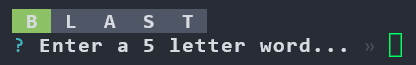
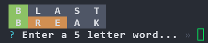
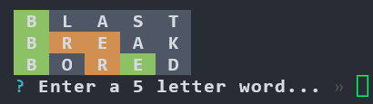
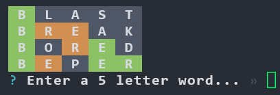
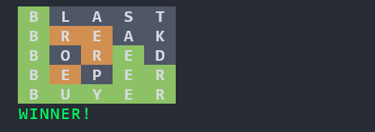

# Wordele

An implementation of the popular Wordle game in Node.js.

#### Screenshot 1

 

#### Screenshot 2

#### Screenshot 3

#### Screenshot 4

#### Screenshot 5

#### Screenshot 6

## Running

> Warning: Resizing terminal after starting will mess with the layout. 
> INFO: try to run terminal in full screen before running

This project requires Node v12 or higher.

1. Run `npm install`
1. Run `npm start`. Alternatively in VS Code, press <kbd>F5</kbd>.
